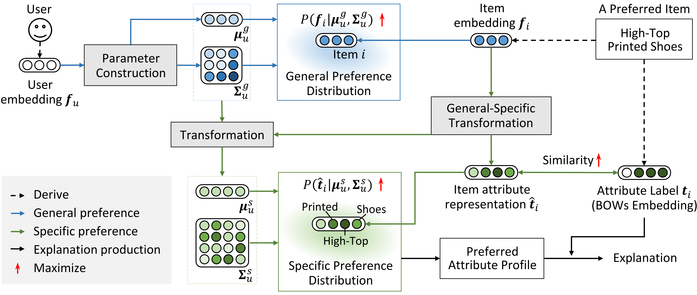

# `Dual Preference Distribution Learning for ItemRecommendation`

> `Offical implement of Dual Preference Distribution Learning for Item Recommendation`

## Authors

**Xue Dong**<sup>1</sup>, **Xuemeng Song**<sup>1</sup>\*, **Na Zheng**<sup>2</sup>, **Yinwei Wei**<sup>2</sup>, **Zhongzhou Zhao**<sup>3</sup>

<sup>1</sup> Shandong University, China

<sup>2</sup> National University of Singapore, Singapore

<sup>3</sup> DAMO Academy, Alibaba Group, China

\* Corresponding author

## Links

- **Paper**: [`Paper Link`](<https://dl.acm.org/doi/10.1145/3565798>)

---

## Table of Contents

- [Updates](#updates)
- [Introduction](#introduction)
- [Method / Framework](#method--framework)
- [Project Structure](#project-structure)
- [Usage](#usage)
- [Citation](#citation)
- [Acknowledgement](#acknowledgement)
- [License](#license)

---

## Updates
> - [04/2026] Initial release

---

## Introduction
Recommender systems can automatically recommend users with items that they probably like. The goal of them is to model the user-item interaction by effectively representing the users and items. Existing methods have primarily learned the user’s preferences and item’s features with vectorized embeddings, and modeled the user’s general preferences to items by the interaction of them. In fact, users have their specific preferences to item attributes and different preferences are usually related. Therefore, exploring the fine-grained preferences as well as modeling the relationships among user’s different preferences could improve the recommendation performance. Toward this end, we propose a dual preference distribution learning framework (DUPLE), which aims to jointly learn a general preference distribution and a specific preference distribution for a given user, where the former corresponds to the user’s general preference to items and the latter refers to the user’s specific preference to item attributes. Notably, the mean vector of each Gaussian distribution can capture the user’s preferences, and the covariance matrix can learn their relationship. Moreover, we can summarize a preferred attribute profile for each user, depicting his/her preferred item attributes. We then can provide the explanation for each recommended item by checking the overlap between its attributes and the user’s preferred attribute profile. Extensive quantitative and qualitative experiments on six public datasets demonstrate the effectiveness and explainability of the DUPLE method.


## method--framework
### Framework Figure

```markdown

```
**Figure 1.** Overall framework.

---

## Project Structure

```text
.
├── data/                  # datasets
├── README.md
├── helper.py
└── DUPLE.py
```

---

## Usage

```bash
python3 DUPLE.py --dataset ml-1m
```
---

## Citation

```bibtex
@article{DongSZWZ23,
  author       = {Xue Dong and
                  Xuemeng Song and
                  Na Zheng and
                  Yinwei Wei and
                  Zhongzhou Zhao},
  title        = {Dual Preference Distribution Learning for Item Recommendation},
  journal      = {{ACM} Trans. Inf. Syst.},
  volume       = {41},
  number       = {3},
  pages        = {56:1--56:22},
  year         = {2023},
}
```

---

## Acknowledgement

- Thanks to our supervisor and collaborators for valuable support.
- Thanks to the open-source community for providing useful baselines and tools.


## License

This project is released under the Apache License 2.0.
